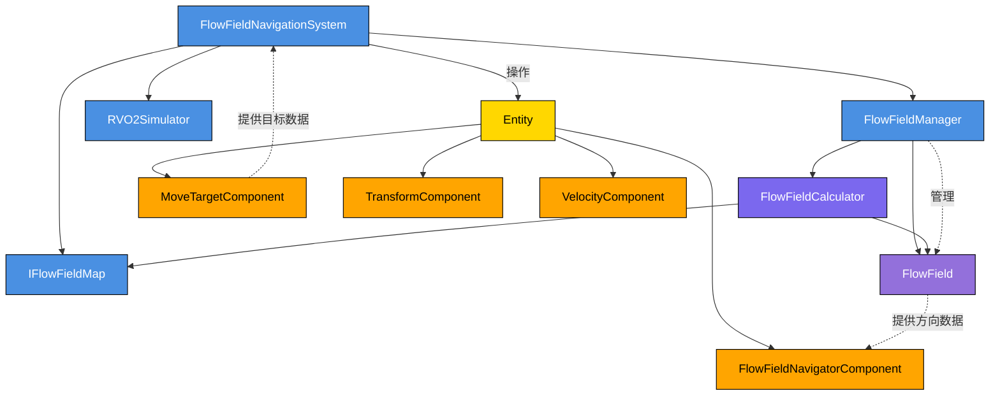

# 流场导航系统架构

## 组件关系图

## 组件说明

### 核心系统类（蓝色）
- **FlowFieldNavigationSystem**：主要的导航系统，负责协调整个导航流程
- **FlowFieldManager**：流场管理器，负责流场的创建、缓存和生命周期管理
- **RVO2Simulator**：RVO避障模拟器，处理单位间的避障行为
- **IFlowFieldMap**：地图接口，提供地图数据访问

### 工具类（紫色）
- **FlowFieldCalculator**：流场计算器，实现核心算法，包括Dijkstra路径查找

### 数据类（紫色）
- **FlowField**：流场数据，存储每个网格的方向向量和到目标的代价

### ECS实体与组件（黄色/橙色）
- **Entity**：ECS实体，承载各种组件
- **FlowFieldNavigatorComponent**：流场导航组件，存储导航相关数据
- **MoveTargetComponent**：移动目标组件，存储单位的目标位置
- **TransformComponent**：变换组件，存储实体的位置信息
- **VelocityComponent**：速度组件，存储实体的速度信息

## 数据流向

1. FlowFieldNavigationSystem 通过 IFlowFieldMap 获取地图信息
2. 当实体需要导航时，FlowFieldNavigationSystem 向 FlowFieldManager 请求流场
3. FlowFieldManager 使用 FlowFieldCalculator 计算流场并缓存为 FlowField 对象
4. 实体通过 FlowFieldNavigatorComponent 和 MoveTargetComponent 存储导航状态
5. FlowFieldNavigationSystem 从 FlowField 中采样方向数据，结合 RVO 避障计算最终移动方向
6. 最终位置同步到 TransformComponent 和 VelocityComponent

## 依赖关系

- FlowFieldNavigationSystem 依赖 FlowFieldManager、RVO2Simulator 和 IFlowFieldMap
- FlowFieldManager 使用 FlowFieldCalculator 进行流场计算
- FlowFieldCalculator 依赖 IFlowFieldMap 提供的地图数据
- Entity 包含多个组件，由 FlowFieldNavigationSystem 操作