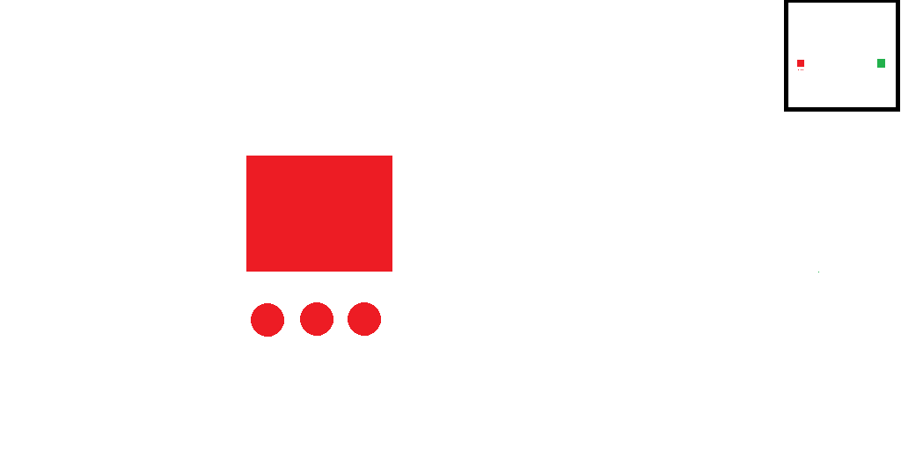
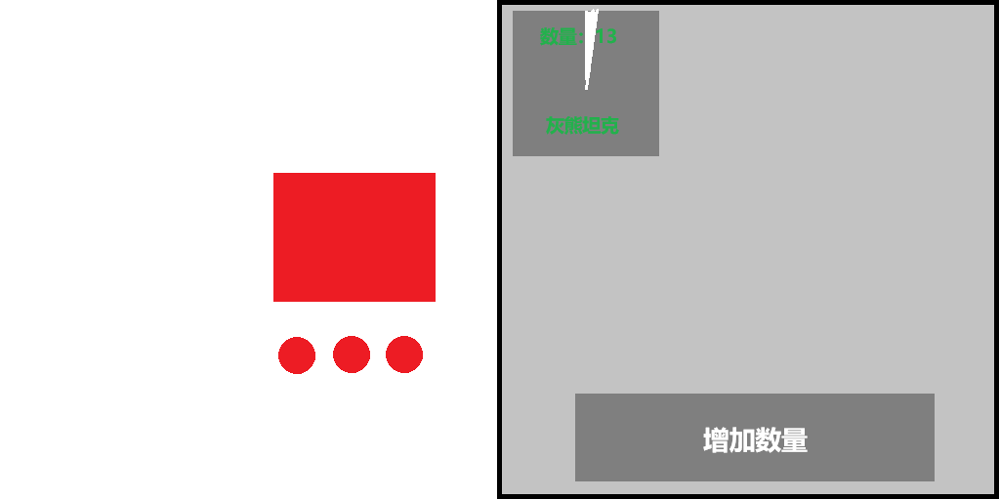

# 《红警》手机（微信小程序）版
## 登录
- 首次登录，随机用户名称，可以修改，缓存本地即可
- 接入微信，直接使用微信名称即可。

## 大厅
- 显示房间列表
- 搜索房间（进入）
- 快速房间：进入创建最早没有密码的房间
- 创建房间：有密码，不支持快速进入

## 房间
- 等待玩家进入（开始支持1-4人即可）
- 显示玩家列表
- （房主）开始游戏
- （房主）踢出玩家

# 游戏
- 3D场景实现，为后期改为3D元素作为基础。也简化了寻路的实现，避免使用菱形格子计算。

## 地图
- 大地图：1024*512像素
- 小地图：128*128像素（屏幕右上角）
- 相机移动操作：按住小地图，实现快速拖动；按住大地图，也可以慢速拖动（这里可以根据测试效果，进一步调整）。
- 寻路：基础是A*寻路，可以优化，比如使用动态规划，或者使用A*的变种。实现建筑物阻挡，战斗单元的阻挡防止重叠即可。

## 战斗元素
- 玩家数量：2v2对战
- 出生每个玩家一个坦克工厂：玩家1（红色）位置：(128, 256)；玩家2（绿色）位置：(896, 256)
- 每个坦克工厂附近创建5个坦克。

## 坦克工厂
- 创建坦克：点击坦克工厂，弹出UI，选择要创建的坦克，例如：“灰熊坦克”，增加一个数量，如果要减少一个坦克，则先点击下面的“增加数量”按钮，变为“减少数量”。再点击“灰熊坦克”按钮，即可减少创建的数量。
- 点击左边空处，关闭UI。如果使用全屏UI，则需要增加关闭按钮。
- 坦克每10秒创建一个坦克，可以在“灰熊坦克”按钮上使用旋转特效，或者使用进度条特效等。

## **2. 核心操作方案**

### **2.1 基础控制（镜头与视角）**

*   **镜头移动：**
    *   **拖拽：** 单指在屏幕空白处拖拽来移动镜头。最符合直觉，节省UI空间。

*   **镜头缩放：**
    *   **双指捏合**进行缩放。这是移动端标准操作，无需解释。

### **2.2 单位选择与控制**

*   **单选：** 直接点击一个单位即可选中。
*   **框选：**
    *   在屏幕**空白处**长按并拖拽，出现一个半透明的矩形框。
    *   释放手指后，矩形框内的所有**同类单位**将被选中。
    *   **优化：** 框选优先级：战斗单位 > 工人单位（矿车）> 建筑。

*   **多选/编队：**
    *   **双击单位：** 双击一个单位，可选中屏幕内所有同类型单位。
    *   **编队功能：**
        1.  选中单位后，屏幕下方会出现一个 **“编队”按钮**。
        2.  点击后，出现1-5的数字编队槽。
        3.  点击一个数字（如“1”），将这些单位编入第1队。
        4.  之后，**快速双击**屏幕任意位置的数字“1”，即可随时选中该编队。
    *   **长按编队图标：** 长按编队数字图标可以查看编队内单位的大概信息和状态。

*   **单位指令：**
    *   **移动：** 选中单位后，**点击**目标地点。出现一个绿色的箭头或脚印特效作为反馈。
    *   **攻击：** 选中单位后，使用屏幕下方的 **“攻击”按钮**，然后点击目标单位或地点。攻击按钮会高亮，提示当前处于攻击指令模式。
    *   **强制攻击（拆建筑）：** 长按“攻击”按钮，会展开一个次级菜单，选择“强制攻击”或“攻击地面”。
    *   **停止：** 屏幕下方提供明确的 **“停止”按钮**。
    *   **巡逻：** 长按“移动”按钮或从次级菜单中选择“巡逻”。

## 攻击
- 坦克每秒攻击一次
- 坦克攻击从坦克位置发射炮弹到目标坐标位置，显示弹道，到达目标位置播放爆炸动画。获取目标格子的单位，进行掉血处理。如果被攻击者离开，则判断掉血失败。
- 坦克攻击范围：3米，如果距离过远，则先移动到攻击范围2米内，再攻击。
- 炮弹爆炸范围：1.5米,可以根据距离判定。
- 坦克攻击效果：弹道，爆炸

# 攻击属性

- 伤害=攻击力-防御

## 坦克
- 攻击力：50
- 防御：5
- 血量：200
- 大约5次被摧毁

## 坦克工厂
- 攻击：0
- 防御：20
- 血量：1000
- 大约30次被摧毁，5辆坦克一起攻击需要6次。

## 结束判定
- 坦克工厂的血量，暂定1000，根据实际效果调整。
- 坦克工厂被摧毁，结束游戏。
- 一方弹出“胜利”，另一方弹出“失败”，结束游戏。
- 游戏结束，点击“返回大厅”。

