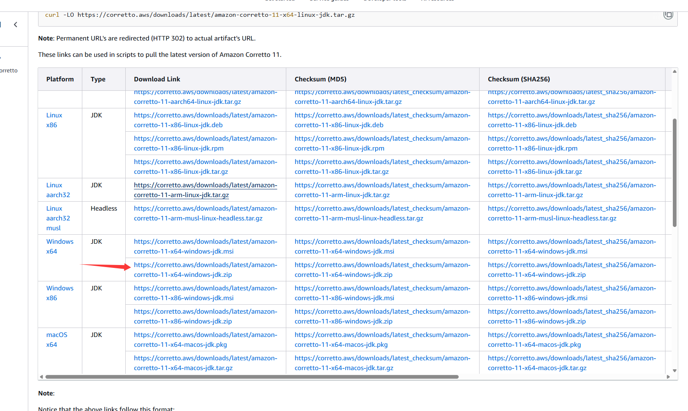

# 启动

## 下载jdk11
https://docs.aws.amazon.com/corretto/latest/corretto-11-ug/downloads-list.html



## 1、解压jdk11压缩包到当前目录：jdk11.0.29_7

解压后，目录结构：
```
server/jdk11.0.29_7
                    /bin
                    /conf
                    ...
```

## 2、运行: jar/ra2.bat
```
Starting ra2 server...
Using JDK: ..\jdk11.0.29_7
2025-10-24 10:45:12
2025-10-24 10:45:13
2025-10-24 10:45:14
2025-10-24 10:45:15
2025-10-24 10:45:16
2025-10-24 10:45:17
2025-10-24 10:45:18
2025-10-24 10:45:19
2025-10-24 10:45:20
```

# 源码目录
ra2server